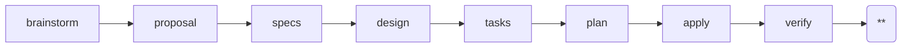

---
parameter:
  instruction: string, required
  return: string
  check: string
  produce: list
on_check: |
  Verify the following:
  <check>{{ check }}</check>
  Inspect the work and confirm the condition holds.
---
This is a Superpowers-powered spec-driven workflow. Current position: archive (**).



Archive the completed change by running the manual archive flow. The change has
already passed verify; if delta specs existed and the user chose to sync, that
sync has already folded the deltas into `openspec/specs/`. Your job now is to
move the change directory into the archive.

Perform the archive:

1. Create the archive directory if it does not exist:
   ```bash
   mkdir -p openspec/changes/archive
   ```
2. Move the change directory into the archive. Follow the archive skill's
   naming convention for the target directory name (the skill names archive
   targets as `YYYY-MM-DD-<change>`; use today's date). Do not copy — move, so
   the change no longer appears under `openspec/changes/`:
   ```bash
   mv openspec/changes/<change> openspec/changes/archive/<target-name>
   ```
   The `.openspec.yaml` moves with the directory automatically; do not strip it.

**If the archive target already exists**, do NOT overwrite. Stop and report the
conflict (suggest renaming the existing archive or using a different date) via
`steer instance error` rather than clobbering prior work.

<instruction>{{ instruction }}</instruction>

After the move, confirm by listing both directories:
- `openspec/changes/<change>` should no longer exist.
- `openspec/changes/archive/<target-name>` should exist and contain the moved
  artifacts (proposal.md, design.md, specs/, tasks.md, verify.md,
  .openspec.yaml, etc.).

<rules>
- LANGUAGE: Write all output in English, regardless of the user's language. Code comments and variable names follow the project's existing conventions, but prose MUST be English.
- Move, do not copy: the change must leave `openspec/changes/` and appear only under `openspec/changes/archive/`.
- Preserve `.openspec.yaml` — it travels with the directory; do not delete or rewrite it.
- Do not sync specs here. Spec sync (if any) already happened in the prior phase. If you believe the main specs are out of sync, stop and report rather than re-syncing unsupervised.
- If the archive target already exists, STOP and report the conflict; never overwrite an existing archive.
- Execute only this instruction. Do NOT skip ahead or do unplanned work.
</rules>
