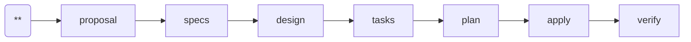

---
parameter:
  instruction: string, required
  return: string
  check: string
  produce: list
on_check: |
  Verify the following:
  <check>{{ check }}</check>
  Inspect the work and confirm the condition holds.
---
This is a Superpowers-powered spec-driven workflow. Current position: brainstorm (**).

Do NOT invoke skills that start later workflow steps (e.g., writing-plans, finishing-a-development-branch). Skills that support exploration or brainstorming are fine.

Invoke `superpowers:brainstorming` via the Skill tool.

<instruction>{{ instruction }}</instruction>
<produce>Write or update the following files as part of this work:
- {{ f }}
</produce>
<rules>
- LANGUAGE: Write all output in English, regardless of the user's language. Code comments and variable names follow the project's existing conventions, but prose MUST be English.
- brainstorm.md is a RAW CAPTURE: preserve the skill's output verbatim. Do NOT restructure, reformat, or impose a template.
- Do NOT write to `docs/superpowers/specs/`. Write only to the change directory.
- Execute only this instruction. Do NOT skip ahead or do unplanned work.
</rules>
