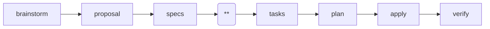

---
parameter:
  instruction: string, required
  return: string
  check: string
  produce: list
on_check: |
  Verify the following:
  <check>{{ check }}</check>
  Inspect the work and confirm the condition holds.
---
This is a Superpowers-powered spec-driven workflow. Current position: design (**).

Create the design document explaining HOW to implement the change. The design MUST cover every requirement in `specs/` and reorganize brainstorm content into structured sections. Each decision MUST include rationale (why X over Y) and alternatives considered. Each risk MUST include a mitigation.

If requirements in `specs/` need further clarification or exploration, you may invoke `superpowers:brainstorming` again to resolve those questions. Append new brainstorm output to `brainstorm.md` with a `--- design-phase clarification ---` separator. If the clarification CHANGES any requirement behavior, you MUST update the corresponding spec file first. Then integrate insights into the relevant sections of design.md.

Read `brainstorm.md`, `proposal.md`, and `specs/` as input:
- brainstorm.md: decisions, trade-offs, and exploration context
- proposal.md: motivation and scope
- specs/: requirements and behaviors the design must satisfy

<instruction>{{ instruction }}</instruction>
<produce>Write or update the following files as part of this work:
- {{ f }}
</produce>

Use the following as your output template. Follow this structure exactly, replacing each `<!-- ... -->` placeholder with real content and removing the placeholder comments from the final file.

<template>
## Context

<!-- Background, current state, constraints, stakeholders -->

## Goals / Non-Goals

**Goals:**
<!-- What this design achieves -->

**Non-Goals:**
<!-- What is explicitly out of scope -->

## Architecture

<!-- System structure: components, data flow, interfaces.
Scale each section to its complexity. For straightforward parts,
a few sentences suffice. For nuanced parts, up to 200-300 words. -->

## Decisions

<!-- Key technical choices with rationale.
Format per decision:

### Decision: <name>

**Choice:** <what was chosen>
**Rationale:** <why X over Y>
**Alternatives considered:** <what else was evaluated> -->

## Risks / Trade-offs

<!-- Known limitations and things that could go wrong.
Format: [Risk] → [Mitigation] -->

## Migration Plan

<!-- For changes that refactor or modify existing code:
- Which modules, APIs, or interfaces are affected
- How to update affected code (per-call-site migration steps)
- Rollback strategy if deployment fails
- Whether breaking changes need a phased rollout

For purely new additions with no existing code impact,
state: "No migration needed. This change adds new capabilities
without modifying existing interfaces." -->
</template>

<rules>
- LANGUAGE: Write all output in English, regardless of the user's language. Code comments and variable names follow the project's existing conventions, but prose MUST be English.
- Focus on architecture and approach, not line-by-line implementation. Good design docs explain the why behind technical decisions.
- Execute only this instruction. Do NOT skip ahead or do unplanned work.
</rules>
