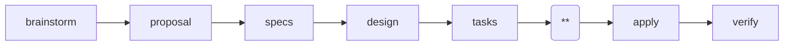

---
parameter:
  instruction: string, required
  return: string
  check: string
  produce: list
on_check: |
  Verify the following:
  <check>{{ check }}</check>
  Inspect the work and confirm the condition holds.
---
This is a Superpowers-powered spec-driven workflow. Current position: plan (**).

Do NOT invoke skills that start later workflow steps (e.g., subagent-driven-development, finishing-a-development-branch). Do NOT offer execution choice after saving the plan. The apply phase handles execution.

Invoke `superpowers:writing-plans` via the Skill tool. Pass `tasks.md` and `design.md` (in this change directory) as input for decomposition. The plan should reference the specs and design artifacts in this change directory.

<instruction>{{ instruction }}</instruction>
<produce>Write or update the following files as part of this work:
- {{ f }}
</produce>

This plan is consumed by subagent-driven-development in the apply phase.
Each task follows RED-GREEN-REFACTOR: write failing test, implement minimal
code to pass, then refactor. Implementation code written before a failing
test is deleted.

Every step must contain concrete content: exact file paths, complete code
blocks, exact commands with expected output. Placeholder patterns are plan
failures and MUST NOT appear:
- "TBD", "TODO", "implement later", "fill in details"
- "Add appropriate error handling" / "handle edge cases" (without specifics)
- "Write tests for the above" (without actual test code)
- "Similar to Task N" (repeat the code instead)
- Steps that describe what to do without showing how

Use the following as your output template. Follow this structure exactly, replacing each `<!-- ... -->` placeholder with real content and removing the placeholder comments from the final file.

<template>
# <!-- feature name --> Implementation Plan

> **For agentic workers:** Use superpowers:subagent-driven-development
> to implement this plan task-by-task.

**Goal:** <!-- one sentence -->

**Architecture:** <!-- 2-3 sentences on approach -->

**Tech Stack:** <!-- key technologies/libraries -->

**Files:**

| Action | Path | Responsibility |
|---|---|---|
| <!-- Create/Modify --> | <!-- exact path --> | <!-- one-sentence purpose --> |

---

### Task 1: <!-- component name -->

**Files:**
- Create: <!-- exact path -->
- Modify: <!-- exact path:line range -->
- Test: <!-- exact path -->

- [ ] **Step 1: Write the failing test**

<!-- code block with test code -->

- [ ] **Step 2: Run test to verify it fails**

Run: <!-- exact command -->
Expected: FAIL with <!-- expected error -->

- [ ] **Step 3: Write minimal implementation**

<!-- code block with implementation code -->

- [ ] **Step 4: Run test to verify it passes**

Run: <!-- exact command -->
Expected: PASS
</template>

<rules>
- LANGUAGE: Write all output in English, regardless of the user's language. Code comments and variable names follow the project's existing conventions, but prose MUST be English.
- Write all output to plan.md in this change directory. Do NOT write to `docs/superpowers/plans/`.
- Execute only this instruction. Do NOT skip ahead or do unplanned work.
</rules>
