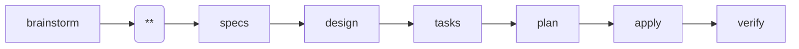

---
parameter:
  instruction: string, required
  return: string
  check: string
  produce: list
on_check: |
  Verify the following:
  <check>{{ check }}</check>
  Inspect the work and confirm the condition holds.
---
This is a Superpowers-powered spec-driven workflow. Current position: proposal (**).

Create a proposal that establishes why this change is needed. Read `brainstorm.md` in this change directory as a key reference, but you may also draw on bug reports, user feedback, performance data, or other evidence beyond what brainstorm captured.

<instruction>{{ instruction }}</instruction>
<produce>Write or update the following files as part of this work:
- {{ f }}
</produce>

Use the following as your output template. Follow this structure exactly, replacing each `<!-- ... -->` placeholder with real content and removing the placeholder comments from the final file.

<template>
## Why

<!-- Explain the motivation for this change. What problem does this solve? Why now? -->

## What Changes

<!-- Describe what will change. Be specific about new capabilities, modifications, or removals. -->

## Capabilities

### New Capabilities
<!-- Capabilities being introduced. Replace <name> with kebab-case identifier (e.g. user-auth, data-export, api-rate-limiting). Each creates specs/<name>/spec.md -->
- `<name>`: <brief description of what this capability covers>

### Modified Capabilities
<!-- Existing capabilities whose REQUIREMENTS are changing (not just implementation).
     Only list here if spec-level behavior changes. Each needs a delta spec file.
     Use existing spec names from openspec/specs/. Leave empty if no requirement changes. -->
- `<existing-name>`: <what requirement is changing>

## Impact

<!-- Affected code, APIs, dependencies, systems -->
</template>

<rules>
- LANGUAGE: Write all output in English, regardless of the user's language. Code comments and variable names follow the project's existing conventions, but prose MUST be English.
- Capabilities create the contract between proposal and specs: every capability listed here must have a corresponding spec file.
- Keep it concise. Focus on the why, not the how.
- Execute only this instruction. Do NOT skip ahead or do unplanned work.
</rules>
