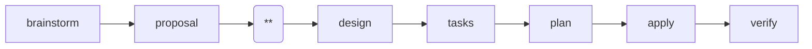

---
parameter:
  instruction: string, required
  return: string
  check: string
  produce: list
on_check: |
  Verify the following:
  <check>{{ check }}</check>
  Inspect the work and confirm the condition holds.
---
This is a Superpowers-powered spec-driven workflow. Current position: specs (**).

Create specification files that define WHAT the system should do. Create one spec file per capability listed in the proposal's Capabilities section:
- New capabilities: use the exact kebab-case name from the proposal (`specs/<capability>/spec.md`).
- Modified capabilities: use the existing spec folder name from `openspec/specs/<capability>/` when creating the delta spec at `specs/<capability>/spec.md`.

<instruction>{{ instruction }}</instruction>
<produce>Write or update the following files as part of this work:
- {{ f }}
</produce>

Requirements
------------

Each requirement MUST use `### Requirement: <name>` followed by a normative
description using SHALL or MUST (avoid should/may).

Delta operations (use `##` section headers):

- ADDED: new requirements introduced by this change.
- MODIFIED: MUST use the exact same normalized header as the existing spec
  (trim, case-sensitive match). MUST paste the full modified content, not
  just a diff. Archive applies MODIFIED via full-text replacement.
- REMOVED: MUST include Reason and Migration to explain why the requirement
  is deprecated and how existing consumers should adapt.
- RENAMED: fixed FROM/TO format using code-fence headers. If a name change
  accompanies content changes, list the rename here AND write the full
  content under the new header in MODIFIED.

Archive apply order: RENAMED, REMOVED, MODIFIED, ADDED.

At least one section MUST contain requirement entries. If all four are empty,
the change is invalid and MUST be rejected.

Scenarios
---------

Scenarios MUST follow BDD-style behavior descriptions.
Each Scenario SHOULD describe behavior from the perspective of an actor or
external observer, not implementation tasks or internal code changes.
Every requirement MUST have at least one scenario. Scenarios MUST use
exactly four hashtags (`####`). Three hashtags or bullets fail silently.

Use the following as your output template. Follow this structure exactly, replacing each `<!-- ... -->` placeholder with real content and removing the placeholder comments from the final file.

<template>
## ADDED Requirements

### Requirement: <!-- requirement name -->
<!-- requirement text -->

#### Scenario: <!-- scenario name -->
- **WHEN** <!-- condition -->
- **THEN** <!-- expected outcome -->

---

## MODIFIED Requirements

### Requirement: <!-- requirement name -->
<!-- requirement text -->

#### Scenario: <!-- scenario name -->
- **WHEN** <!-- condition -->
- **THEN** <!-- expected outcome -->

---

## REMOVED Requirements

### Requirement: <!-- requirement name -->

**Reason**: <!-- why removed -->

**Migration**: <!-- how consumers should adapt -->

---

## RENAMED Requirements

- FROM: `### Requirement: <Old Name>`
- TO: `### Requirement: <New Name>`
</template>

<rules>
- LANGUAGE: Write all output in English, regardless of the user's language. Code comments and variable names follow the project's existing conventions, but prose MUST be English.
- Every requirement MUST have at least one scenario. Specs MUST be testable; each scenario MUST be a potential test case.
- Execute only this instruction. Do NOT skip ahead or do unplanned work.
</rules>
