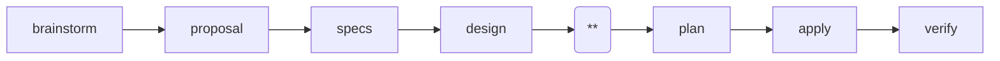

---
parameter:
  instruction: string, required
  return: string
  check: string
  produce: list
on_check: |
  Verify the following:
  <check>{{ check }}</check>
  Inspect the work and confirm the condition holds.
---
This is a Superpowers-powered spec-driven workflow. Current position: tasks (**).

Create the task list that breaks down the implementation work.

IMPORTANT: Follow the checkbox format exactly. The apply phase parses `- [ ]` to track progress. Tasks not using `- [ ]` won't be tracked.

<instruction>{{ instruction }}</instruction>
<produce>Write or update the following files as part of this work:
- {{ f }}
</produce>

Use the following as your output template. Follow this structure exactly, replacing each `<!-- ... -->` placeholder with real content and removing the placeholder comments from the final file.

<template>
## 1. <!-- Task Group Name -->

- [ ] 1.1 <!-- Task description -->
- [ ] 1.2 <!-- Task description -->

## 2. <!-- Task Group Name -->

- [ ] 2.1 <!-- Task description -->
- [ ] 2.2 <!-- Task description -->
</template>

<rules>
- LANGUAGE: Write all output in English, regardless of the user's language. Code comments and variable names follow the project's existing conventions, but prose MUST be English.
- Group related tasks under `##` numbered headings. Each task MUST be a checkbox: `- [ ] X.Y Task description`.
- Tasks should be small enough to complete in one session. Order tasks by dependency.
- Reference specs for what to build, design for how to build it. Each task MUST be verifiable with clear completion criteria.
- Execute only this instruction. Do NOT skip ahead or do unplanned work.
</rules>
