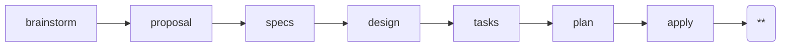

---
parameter:
  instruction: string, required
  return: string
  check: string
  produce: list
on_check: |
  Verify the following:
  <check>{{ check }}</check>
  Inspect the work and confirm the condition holds.
---
This is a Superpowers-powered spec-driven workflow. Current position: verify (**).



Invoke `openspec-verify-change` via the Skill tool. This skill runs consistency checks and produces verify.md:
1. Spec Coverage: every spec requirement has implementation
2. Implementation Coverage: every implementation has spec basis
3. Scenario Testability: every scenario has test or verification path
4. Breaking Changes: breaking items have migration path
5. Behavioral Alignment: spec vs code match
6. Front-Door Routing Leak Detector
7. Template Comment Stray Check

Additionally confirm:
- All tasks.md checkboxes are `- [x]`. Any remaining `- [ ]` is an issue that must be fixed before archive.
- All code changes are committed (no unstaged files).

<instruction>{{ instruction }}</instruction>
<produce>Write or update the following files as part of this work:
- {{ f }}
</produce>

All checks are mandatory. Any gap found MUST be fixed before archive.
Each gap is tracked as `- [ ]`. After fixing, mark it `- [x]`.
Archive only proceeds when every gap is `- [x]`.

Verify MAY be re-run after fixing issues. Each run overwrites
verify.md, but preserve checkbox state from previous runs
(previously `- [x]` items stay `- [x]`).

Use the following as your output template. Follow this structure exactly, replacing each `<!-- ... -->` placeholder with real content and removing the placeholder comments from the final file.

<template>
# Code and Spec Consistency Verification

**Change**: <!-- change name -->
**Verified at**: <!-- YYYY-MM-DD HH:mm -->

---

## 1. Spec Coverage — Every Spec Requirement Has Implementation

For each requirement in specs/, confirm the implemented code covers it.
Read the actual source files, not just plan.md.

<!-- For each requirement, write one line. If no gap, just state
the fact. If a gap exists, use - [ ] checkbox format. -->

<!-- example:
- Requirement: user-login — covered by src/auth/login.ts, src/auth/session.ts
- [ ] Requirement: password-reset — no implementation found
-->

---

## 2. Implementation Coverage — Every Implementation Has Spec Basis

For each implementation file added/modified, confirm a spec requirement
justifies it. Implementation without spec basis is spec drift.

<!-- For each file, write one line. No gap = plain statement.
Gap = - [ ] checkbox. -->

<!-- example:
- src/auth/login.ts — justified by Requirement: user-login
- [ ] src/auth/legacy-handler.ts — no spec basis, dead code or missing spec
-->

---

## 3. Scenario Testability — Every Scenario Has a Test or Verification Path

For each scenario in specs/, confirm a test or manual verification path
exists.

<!-- For each scenario, write one line. No gap = plain statement.
Gap = - [ ] checkbox. -->

<!-- example:
- Scenario: login-success — test in tests/auth.test.ts
- [ ] Scenario: login-expired-token — no test or manual path
-->

---

## 4. Breaking Changes — Breaking Items Have Migration Path

If proposal.md contains BREAKING items, confirm each has a migration
path documented in design or implementation.

<!-- For each breaking item, write one line. No gap = plain statement.
Gap = - [ ] checkbox. -->

<!-- If no BREAKING items: "No breaking changes in this cycle." -->

---

## 5. Behavioral Alignment — Spec vs Code

Spot-check that implemented behavior matches scenario descriptions in
specs/. Focus on edge cases and error handling.

<!-- For each scenario checked, write one line. Match = plain
statement. Deviation = - [ ] checkbox. -->

<!-- example:
- Scenario: login-success — behavior matches spec
- [ ] Scenario: login-invalid-creds — spec says "return 401" but code returns 500
-->

---

## 6. Front-Door Routing Leak Detector

Brainstorm output should not land in `docs/superpowers/specs/`.

```bash
ls docs/superpowers/specs/*.md 2>/dev/null
```

<!-- If files found, each is a - [ ] gap. If none found, write
"No files leaked." -->

---

## 7. Template Comment Stray Check

Verify no artifact file contains the `<!-- INSTRUCTION:` template
comment block. These must be stripped before writing output.

```bash
grep -rl '<!-- INSTRUCTION:' openspec/changes/<name>/ 2>/dev/null
```

<!-- If files found, each is a - [ ] gap. If none found, write
"No stray template comments." -->

---

## Overall Decision

- [ ] PASS: every gap is `- [x]` (all fixed)
- [ ] FAIL: one or more gaps are `- [ ]` (unfixed)

**Notes**: <!-- summary of findings and next steps -->
</template>

<rules>
- LANGUAGE: Write all output in English, regardless of the user's language. Code comments and variable names follow the project's existing conventions, but prose MUST be English.
- CRITICAL: If ANY check identifies a problem, STOP. Fix the issue, then re-run verify. Do NOT proceed to archive until ALL checks pass with zero gaps.
- Execute only this instruction. Do NOT skip ahead or do unplanned work.
</rules>
